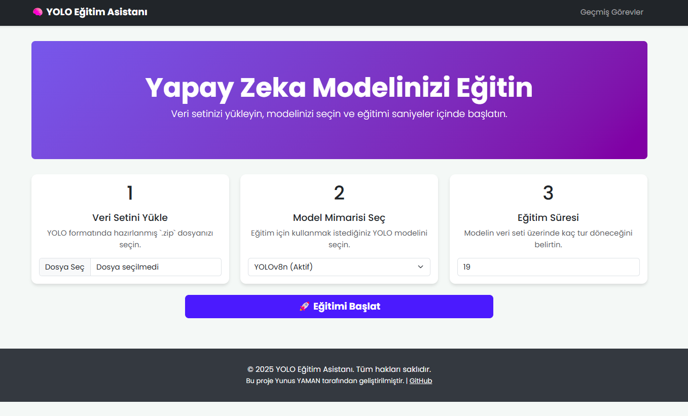
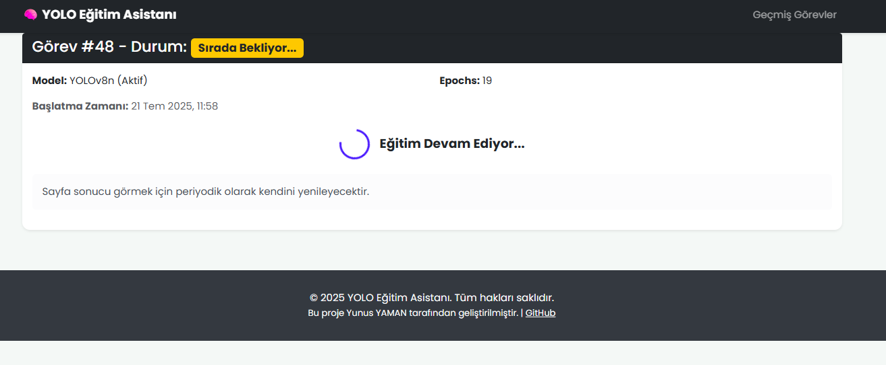
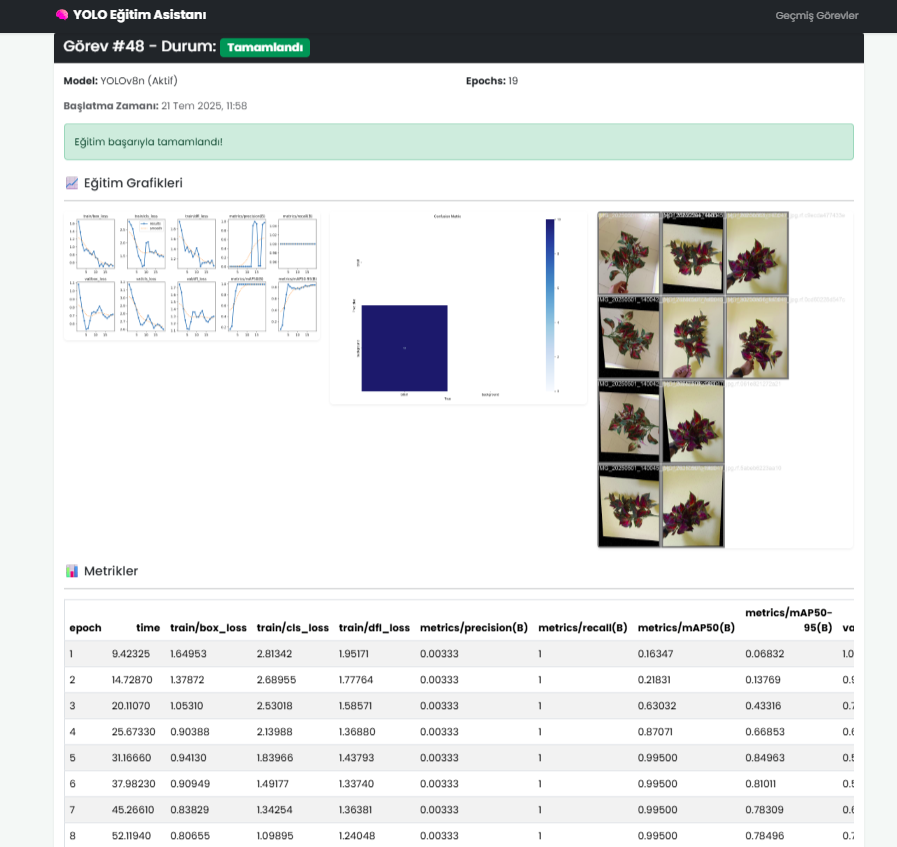
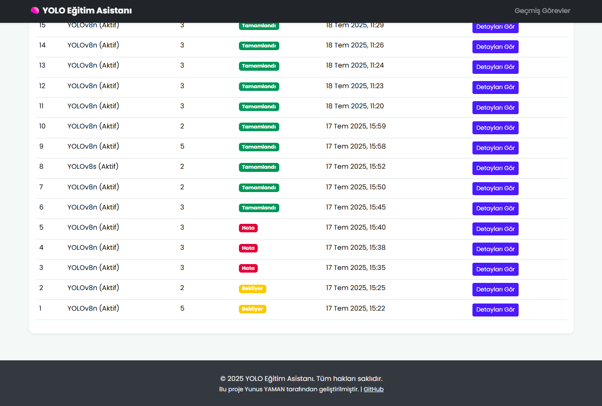

# 🧠 YOLO Eğitim Asistanı: Web Arayüzlü Model Eğitim Platformu


Bu proje, YOLO (You Only Look Once) nesne tanıma modellerinin eğitim sürecini basitleştiren ve web tabanlı bir arayüz üzerinden yönetilmesini sağlayan bir platformdur. Kullanıcılar, kendi veri setlerini kolayca yükleyebilir, popüler YOLO mimarilerinden birini seçebilir ve eğitim sürecini takip ederek sonuçları görsel olarak analiz edebilirler.

Bu proje, karmaşık komut satırı işlemlerine olan ihtiyacı ortadan kaldırarak yapay zeka modeli eğitimini daha erişilebilir hale getirmeyi amaçlamaktadır.

---

## 📸 Ekran Görüntüleri

<table align="center">
 <tr>
    <td align="center"><strong>Ana Sayfa & Eğitim Başlatma</strong></td>
    <td align="center"><strong>Devam Eden Eğitim Görevi</strong></td>
 </tr>
 <tr>
    <td></td>
    <td></td>
 </tr>
 <tr>
    <td align="center"><strong>Tamamlanan Görev & Sonuç Analizi</strong></td>
    <td align="center"><strong>Geçmiş Görevler Listesi</strong></td>
 </tr>
 <tr>
    <td></td>
    <td></td>
 </tr>
</table>

---

## ✨ Özellikler

- **Kullanıcı Dostu Web Arayüzü:** Sezgisel ve modern bir arayüz ile kolay kullanım.
- **Kolay Veri Seti Yükleme:** Standart YOLO formatındaki veri setlerini `.zip` dosyası olarak yükleme imkanı.
- **Model Seçimi:** YOLOv8 ve YOLOv10 gibi farklı ve popüler model mimarileri arasından seçim yapabilme.
- **Asenkron Eğitim Süreci:** Uzun süren eğitim görevleri, web sitesini kilitlemeden arka planda **Celery** ve **RabbitMQ** ile yönetilir.
- **Eğitim Takibi:** Devam eden görevlerin durumunu izleme ve tamamlandığında sonuçları görme (sayfayı yenileyerek).
- **Görsel Sonuç Analizi:** Eğitim sonunda ortaya çıkan başarı metriklerini (mAP, Precision, Recall), kayıp (loss) grafiklerini ve modelin tahmin örneklerini doğrudan arayüzde görüntüleme.
- **Görev Geçmişi:** Önceden tamamlanmış tüm eğitim görevlerini listeleyerek sonuçlarına tekrar erişim sağlama.

---

## 🛠️ Kullanılan Teknolojiler

| Kategori | Teknoloji | Açıklama |
| :--- | :--- | :--- |
| **Backend** |   | Uygulama mantığı ve web sunucusu. |
| **Asenkron Görevler** |   | Uzun süren model eğitimlerini arka planda çalıştırmak için. |
| **Frontend** |    | Modern ve duyarlı arayüz tasarımı. |
| **Yapay Zeka** |  | Nesne tespiti için kullanılan YOLO Modelleri |
| **Veritabanı** |  | Geliştirme ortamı için görev ve sonuç bilgilerinin saklanması. |

---

## 🚀 Kurulum ve Çalıştırma

Projeyi yerel makinenizde çalıştırmak için aşağıdaki adımları izleyin.

### Gereksinimler

- Python 3.8+
- Erlang
- RabbitMQ Server

### Kurulum Adımları

1.  **Projeyi Klonlayın:**
    ```sh
    git clone https://github.com/Yunusyamann/YOLO-Egitim-Asistani--Web-Arayuzlu-Model-Egitim-Platformu.git
    cd YOLO-Egitim-Asistani
    ```

2.  **Erlang ve RabbitMQ'yu Yükleyin:**
    - [Erlang İndirme Sayfası](https://www.erlang.org/downloads)
    - [RabbitMQ İndirme Sayfası](https://www.rabbitmq.com/install-windows.html)
    - Kurulumdan sonra RabbitMQ yönetim arayüzünü aktive edin: `rabbitmq-plugins enable rabbitmq_management`

3.  **Python Sanal Ortamını Oluşturun ve Aktive Edin:**
    ```sh
    python -m venv venv
    .\venv\Scripts\activate
    ```

4.  **Gerekli Kütüphaneleri Yükleyin:**
    
    ```sh
    pip install -r requirements.txt
    ```

5.  **Veritabanı Kurulumu:**
    ```sh
    python manage.py migrate
    ```

### Uygulamayı Çalıştırma

Projenin tam fonksiyonel olması için **2 terminal ve 1 arka plan servisine** ihtiyacınız var:

1.  **RabbitMQ Servisini Başlatın:**
    - Başlat menüsünden "RabbitMQ Server" uygulamasını çalıştırın.

2.  **Terminal 1: Celery Worker'ı Başlatın:**
    ```sh
    celery -A yolo_project worker -P solo --loglevel=info
    ```

3.  **Terminal 2: Django Web Sunucusunu Başlatın:**
    ```sh
    python manage.py runserver
    ```

Uygulama artık `http://127.0.0.1:8000/` adresinde çalışıyor olacaktır!
Tüm sorularınız için yunusyaman0110@gmail.com adresinden iletişime geçebilirsiniz.
